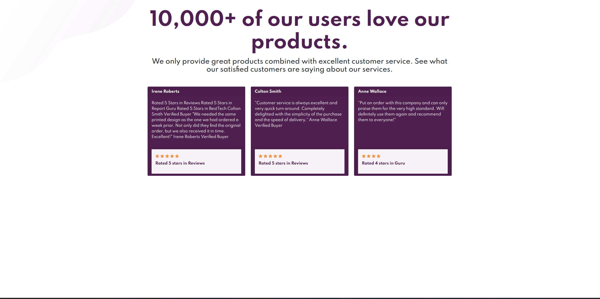

# HTML CSS and Bootstrap assessment

Your task is to create an HTML page that resembles the one below.

Please make sure to fork this repo to yours and then clone and complete the assessment.

## Design

### Font to be used

- Family: [Spartan](https://fonts.google.com/specimen/Spartan)
- Weights: 400, 500, 700

### Colours to be used

### Primary

Very Dark Magenta: hsl(300, 43%, 22%)

Soft Pink: hsl(333, 80%, 67%)

### Neutral

Dark Grayish Magenta: hsl(303, 10%, 53%)

Light Grayish Magenta: hsl(300, 24%, 96%)

White: hsl(0, 0%, 100%)
